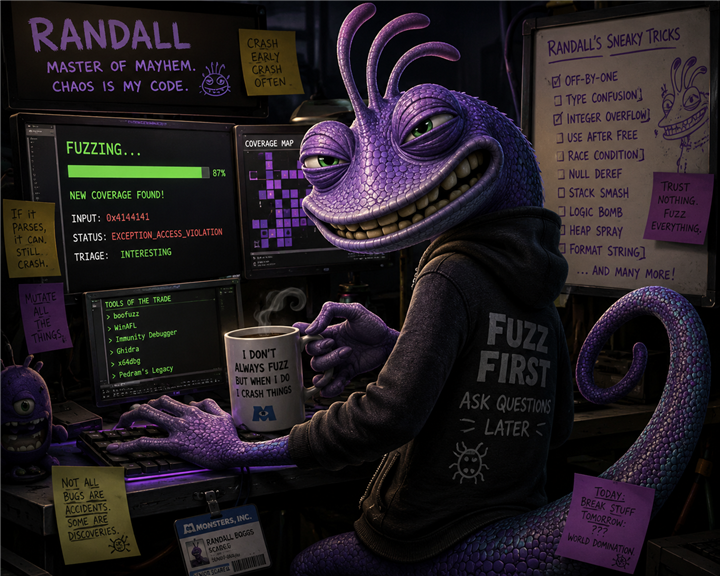
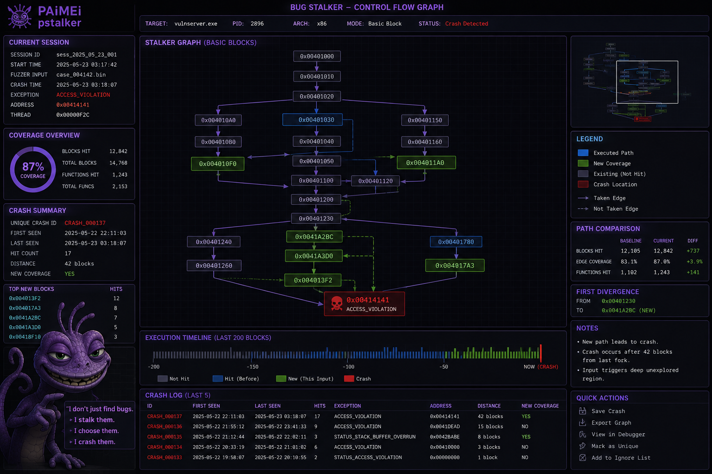

# Randfuzz by Randall

<div align="center">
  <a href="docs/assets/randall.png">
    
  </a>
  <br />
  <em>Stalk code paths. Scream on crash.</em>
</div>

**A next-generation fuzzer for Windows** — generation, coverage-guided stalking, and crash triage in native C#/.NET.

I don't just throw bytes at parsers and hope. I **camouflage** valid-looking traffic, **sneak** into code paths nobody's mapped yet, and **scream** when something breaks — minidump and all. Randfuzz pulls the good stuff from the giants before us ([Sulley](https://github.com/OpenRCE/sulley) / [Boofuzz](https://github.com/jtpereyda/boofuzz), [CANAPE](https://github.com/foxitcs/canape), [PaiMei pStalker](https://github.com/OpenRCE/paimei), [DynamoRIO](https://dynamorio.org/)) and runs it as **one stack** — CLI, web UI, portable deploy. Respect to the legends; I'm just the chameleon who wired it together.

**Randfuzz** is the product. **Randall** is the mascot — named after **Randall Boggs** (*Monsters, Inc.*): master of camouflage, competitive to a fault, always sneaking into places he shouldn't be. Yeah, that's the vibe:

| Randall (mascot) | What Randfuzz actually does |
|---------|--------|
| 🦎 **Camouflage** — blend in | Valid shells, plausible protocols, MITM that looks like normal traffic |
| 🐛 **Competitive** — always hunting the edge | Coverage-guided inputs that hit **new** paths |
| 🧪 **Sneak the factory** | Stalk unexplored code with DynamoRIO |
| 💥 **Collect the screams** | Crash capture — you scare the target, it screams (crashes), and you bottle it in a **scream canister** (dump + dedup + triage, Ghidra export) |
| 🕵️ **Another trick up my sleeve** | Havoc, dictionaries, session flows, plugins, in-process harnesses |

Full parody mapping: [docs/LORE.md](docs/LORE.md)

> *Stalk code paths. Scream on crash.*

## Install (Windows 10 / 11 VM)

Fresh VM or bare metal. Full checklist: [docs/INSTALL_WINDOWS.md](docs/INSTALL_WINDOWS.md).

> **Running on Linux?** Randfuzz is cross-platform — see [docs/INSTALL_LINUX.md](docs/INSTALL_LINUX.md) for the Linux lab (gdb/GEF, strace, tcpdump, valgrind, ASan) plus heap-bug triage. Pick the fuzzing platform in the UI sidebar (Auto / Windows / Linux).
>
> **Linux scream triage:** a fuzzer crash becomes a register/offset report (no payloads) — see [docs/EXPLOIT_GUIDE.md](docs/EXPLOIT_GUIDE.md), the mitigation ladder in [docs/MITIGATION_LAB.md](docs/MITIGATION_LAB.md), and coverage stalking in [docs/STALKING.md](docs/STALKING.md).
>
> **Recipe catalog:** browse 100+ fuzzing recipes by target class (file formats, protocols, web) and instantiate a ready-to-fuzz project in one click — Fuzz → Scare Floor → Recipe catalog, or `randall case catalog`. See [docs/RECIPE_CATALOG.md](docs/RECIPE_CATALOG.md).

**Need:** [.NET 8 SDK](https://dotnet.microsoft.com/download/dotnet/8.0) · [Git](https://git-scm.com/download/win) · PowerShell · network (MinGW gcc zip for Scream; winget optional) · ~8 GB RAM recommended

Prefer **`git clone` / `git pull`** over a GitHub ZIP of the repo — you get script fixes without re-downloading the whole tree. If you already unpacked a ZIP under Downloads, clone fresh (or `git pull` on a real clone) so you pick up the zip-based `install-gcc.ps1`.

```powershell
# 1) Clone
cd $env:USERPROFILE\Projects
git clone https://github.com/jinverar/randall.git
cd randall

# 2) Build fuzzer + lab targets (installs MinGW gcc via WinLibs zip if missing — no winget required)
dotnet build
# Windows often blocks scripts (ExecutionPolicy Restricted) — use Bypass for this file:
powershell -ExecutionPolicy Bypass -File .\scripts\build-all-lab-targets.ps1
# Skip gcc/Scream only:  ...\build-all-lab-targets.ps1 -SkipGcc
# gcc alone:             ...\install-gcc.ps1   (-Verbose for logs)
# After gcc install: open a new shell before using gcc elsewhere

# 3) Recording companions (Sysinternals Suite → tools\; optional Frida / API Monitor)
powershell -ExecutionPolicy Bypass -File .\scripts\install-recording-tools.ps1
# Or umbrella: gcc + DynamoRIO + recording → ...\install-lab-tools.ps1

> **IMPORTANT:** **pktmon** and **ETW/WPR** recording need Randfuzz (`serve` / `agent`) run from an **Administrator** terminal. Unelevated runs soft-skip those captures. See [docs/RECORDING.md](docs/RECORDING.md).

# 4) Optional — coverage (DynamoRIO). IMPORTANT: may take a while (large zip; slow networks).
#    Or manual: download DynamoRIO-Windows-*.zip, unzip, then rename the folder to
#    exactly tools\dynamorio (NOT tools\DynamoRIO-Windows-*) so
#    tools\dynamorio\bin64\drrun.exe exists (see Optional — DynamoRIO below).
#    Coverage later / skip for now:  ...\install-dynamorio.ps1 -Skip
powershell -ExecutionPolicy Bypass -File .\scripts\install-dynamorio.ps1
$env:DYNAMORIO_HOME = (Resolve-Path tools\dynamorio).Path

# 5) Preflight
dotnet run --project src\Randall.Cli -- doctor -c projects\vulnserver.yaml

# 6) Web UI
dotnet run --project src\Randall.Server --urls http://127.0.0.1:5000
```

If you see *“running scripts is disabled on this system”*, that Bypass form is the fix (or run once: `Set-ExecutionPolicy -Scope CurrentUser RemoteSigned`).

### Updating the VM (after first install)

**Clone once, pull + rebuild** — do not re-download the GitHub ZIP or re-run full tool installs every time. Binaries under `tools/` (DynamoRIO, Sysinternals, MinGW) stay on disk; `git pull` only refreshes source.

```powershell
cd $env:USERPROFILE\Projects\randall   # or wherever you cloned

# Stop Randall.Server first if it is running (avoids locked DLLs during rebuild)
powershell -ExecutionPolicy Bypass -File .\scripts\update-lab.ps1
# Re-install tools only when scripts/docs say so:  ...\update-lab.ps1 -InstallTools

dotnet run --project src\Randall.Server --urls http://127.0.0.1:5000
```

Migrating off `Downloads\randall-main` ZIP: clone fresh (above), **copy your existing `tools\` folder into the clone once** (gcc, dynamorio, Sysinternals exes are gitignored), run `install-lab-tools.ps1` only if something is still missing. Keep secrets in `projects/local/` or `.env` — also gitignored.

Full checklist: [docs/INSTALL_WINDOWS.md](docs/INSTALL_WINDOWS.md#updating-the-vm-after-first-install).

Open **[http://127.0.0.1:5000](http://127.0.0.1:5000)** — Dashboard (stalker CFG), Fuzz, Crashes, Case builder, Help.

Smoke:

```powershell
dotnet run --project src\Randall.Cli -- fuzz -c projects\vulnserver.yaml --dry-run
```

Remote lab box: `dotnet run --project src\Randall.Cli -- agent --port 5000` → open `http://<vm-ip>:5000` from the host ([docs/LAB_AGENT.md](docs/LAB_AGENT.md)).

## Tricks borrowed from the greats

I'm not here to rewrite history. I'm here to **stop duct-taping six runtimes** every time you fuzz on Windows. These are the shoulders I stand on:

| Tool / tradition | What Randfuzz took and ran with |
|-------------|----------------------|
| **[Sulley / Boofuzz](https://github.com/jtpereyda/boofuzz)** | Block models, sessions, mutations — generation fuzzing done right |
| **[CANAPE](https://github.com/foxitcs/canape)** | MITM capture, parse, inject — see the wire before you break it |
| **[PaiMei pStalker](https://github.com/OpenRCE/paimei)** | Color-coded stalking — new edges, first divergence, crash paths |
| **[DynamoRIO](https://dynamorio.org/)** | Fast drcov instrumentation |
| **AFL / libFuzzer** | Persistent & fork-server style warm workers; in-process `LLVMFuzzerTestOneInput` |
| **Ghidra / triage** | Export coverage and crashes for the reverse-engineering grind |

Boofuzz and AFL still slap. Randfuzz is for when you want **generation + stalking + proxy + triage** under one roof — next-gen pipeline, same ethics: **authorized targets only**.

## Stalking bugs — how I see the factory floor

<div align="center">
  <a href="docs/assets/randal_stalking_bugs.png">
    
  </a>
  <br />
  <em>I don't just find bugs. I stalk them. I choose them. I crash them.</em>
</div>

This is the view [PaiMei pStalker](https://github.com/OpenRCE/paimei) made famous — **color tells you where the input went** before the scream. Blue path, green new territory, red crash site. I didn't invent it; I just think every fuzzer should *feel* like this when you're triaging.

### Color legend (pStalker method)

| Color | Meaning | How Randfuzz uses this |
|-------|---------|-------------------|
| **Blue** | Blocks on the **executed path** — code this input actually ran through | Known corpus paths; replayed inputs that hit the same edges |
| **Green** | **New coverage** — basic blocks or edges seen for the first time | DynamoRIO drcov novelty; corpus entries that expand the frontier (`+N edges` in the fuzz log) |
| **Gray** | Blocks you **didn't take** this run | Unexplored forks — dinner's still on the table |
| **Red** | **Crash location** (e.g. `ACCESS_VIOLATION`) | `CrashRecord` + minidump + triage tag from RPP `post_crash` |

Solid arrows = **taken**. Dashed = **not yet** — that's where I'm going next.

### What the panels mean

| Panel | Classic idea (pStalker-style) | In Randfuzz |
|-------|---------------|------------|
| **Coverage overview** | How much of the target have we mapped? | Corpus stats, `/api/corpus/{project}`, DynamoRIO edge counts |
| **Path comparison** | Baseline run vs current run — did we learn anything? | Corpus energy / power schedule; inputs that add edges get kept |
| **First divergence** | Where did this input peel off from the last known good path? | Crash path dedup + cluster triage (Phase 4) |
| **Execution timeline** | Last N blocks before the scream | Live fuzz log — green `+edges` moments are the good stuff |
| **Crash log** | Which exceptions came with new coverage? | Crashes tab — filter by project, triage tags, export to Ghidra bundle |

**Generation meets stalking:** models get weird bytes through the door; coverage tells me what's worth keeping. Fire up [`randall serve`](docs/LAB_PRACTICE.md#8-web-ui) — my web console for fuzz runs, session graphs, crashes, and coverage. *Chaos is my code*, but at least it's organized chaos.

Leg 4 deep dive: [docs/LEGS.md#leg-4--stalk-coverage](docs/LEGS.md#leg-4--stalk-coverage)

## Eight legs, zero mercy

Eight capability areas. One chameleon. See [docs/LEGS.md](docs/LEGS.md) for the full map.

| Leg | Module | Concept |
|-----|--------|---------|
| 1 | **Model** | Define protocols with blocks and primitives |
| 2 | **Mutate** | Generation strategies and field-aware fuzzing |
| 3 | **Send** | Network, file, stdin, and in-process harness delivery |
| 4 | **Stalk** | DynamoRIO coverage and frontier detection |
| 5 | **Scream** | Crash capture, dedup, minidumps, Discord/email alerts |
| 6 | **Proxy** | MITM capture and live traffic editing (CANAPE-inspired) |
| 7 | **Web** | Browser UI + API for lab and remote use |
| 8 | **Pack** | Portable standalone folders and project bundles |

## Architecture

```
Randall.Core          Engine (models, mutations, corpus, crashes)
Randall.Infrastructure   SQLite, DynamoRIO, monitors
Randall.Server        ASP.NET Core API + web UI
Randall.Cli           Headless: fuzz, serve, replay, export
Randall.Contracts     Shared DTOs
```

Details: [docs/ARCHITECTURE.md](docs/ARCHITECTURE.md)

## Factory floor (lab targets)

Built-in vulnerable targets for practice — **your** factory, **your** permission slip. Default profiles: **vulnserver** (TCP), plus **file-text** / **file-framed** templates. Got something private? `projects/local/` is gitignored.

```powershell
dotnet run --project src/Randall.Cli -- targets
dotnet run --project src/Randall.Cli -- fuzz -c projects/vulnserver.yaml --dry-run
```

See [docs/TARGETS.md](docs/TARGETS.md) and [targets/README.md](targets/README.md).

**Fuzz your own program:** write a YAML under `projects/` or `projects/local/` — the `name:` field becomes the **Target profile** in the UI. Build seeds in **Fuzz → Case builder** or `randall case …`. Guides: [docs/CUSTOM_TARGETS.md](docs/CUSTOM_TARGETS.md), [docs/CASE_BUILDER.md](docs/CASE_BUILDER.md), templates in [docs/templates/](docs/templates/).

**Hands-on lab walkthrough:** [docs/LAB_PRACTICE.md](docs/LAB_PRACTICE.md)

### Target Runtime (local & remote)

Start·stop·restart for long-lived targets, remote lab agent, crash artifact packs, memory/heap lens:

- [docs/TARGET_RUNTIME.md](docs/TARGET_RUNTIME.md) · [docs/LAB_AGENT.md](docs/LAB_AGENT.md) · [TARGET_RUNTIME_README.txt](TARGET_RUNTIME_README.txt)

**Observation stack (Procmon, ETW/WPR, snapshots, TCPVCon, DebugView, pktmon, Scream/PageHeap, + Frida/API Monitor companions) + workstation layout:** [docs/RECORDING.md](docs/RECORDING.md). **IMPORTANT:** pktmon + ETW/WPR need `serve` / `agent` from an **Administrator** terminal (see that doc).

### In-process harnesses (persistent / cold / forkServer)

Fuzz parsers and libraries **in-process** (managed `IInProcessHarness` or native `LLVMFuzzerTestOneInput`) with an explicit isolation matrix:

| Mode | YAML | Behavior |
|------|------|----------|
| **Persistent + forkServer** | `persistent: true`, `forkServer: true` | Warm harness; `Reset()` each case; recycle after crash |
| **Cold (non-persistent)** | `persistent: false` | Reload / new worker every case — reproducibility baseline |
| **Strict** | `harnessStrict: true` | Refuse warm start without `IInProcessHarnessReset` |

**One rule:** let the **target** reject invalid input — do not over-filter in the harness. Crashes are never swallowed. Perf signals (`avgFuzzOne`, resets, recycles) are logged so you can question results.

```powershell
dotnet build targets/Randall.HarnessDemo
dotnet run --project src/Randall.Cli -- fuzz -c projects/harness-demo.yaml
```

Docs: [docs/HARNESS_DESIGN.md](docs/HARNESS_DESIGN.md) · [docs/IN_PROCESS.md](docs/IN_PROCESS.md) · [docs/PERSISTENT.md](docs/PERSISTENT.md)

## Optional — DynamoRIO (coverage-guided stalking)

Coverage is **optional**. Randfuzz finds crashes without it. Install DynamoRIO when you want `+N edges` in the fuzz log and corpus inputs ranked by new basic blocks.

> **Important:** `powershell -ExecutionPolicy Bypass -File .\scripts\install-dynamorio.ps1` **may take a while** — the Windows zip is large, and slow VM/NAT links can run for many minutes. That is normal; let it finish, or use the manual path below.

### Install (pick one)

**A. Script (downloads latest release — progress + resume via `curl.exe` / BITS)**

```powershell
powershell -ExecutionPolicy Bypass -File .\scripts\install-dynamorio.ps1
```

**B. Manual download + unzip into `tools`**

> **IMPORTANT:** The extracted folder **must** be named `tools\dynamorio` — **not** `tools\DynamoRIO-Windows-11.3.0` or any versioned name. After unzip, rename/move the top-level `DynamoRIO-Windows-*` folder to exactly `tools\dynamorio` so `tools\dynamorio\bin64\drrun.exe` exists.

1. Open [DynamoRIO releases](https://github.com/DynamoRIO/dynamorio/releases) and download the Windows asset `DynamoRIO-Windows-*.zip`  
   (URL pattern: `https://github.com/DynamoRIO/dynamorio/releases/download/<tag>/DynamoRIO-Windows-<version>.zip` — e.g. `.../download/release_11.3.0/DynamoRIO-Windows-11.3.0.zip`).
2. Extract the zip. The archive contains a single top-level folder (e.g. `DynamoRIO-Windows-11.3.0`).
3. **Rename/move** that folder to exactly `tools\dynamorio` (do **not** leave it as `tools\DynamoRIO-Windows-11.3.0`). Confirm:

```
tools\dynamorio\bin64\drrun.exe
```

Layout after install:

```
tools\
  dynamorio\          ← must be this exact name (not DynamoRIO-Windows-*)
    bin64\
      drrun.exe
    ...
```

Or pass the zip to the script instead of extracting by hand (the script renames for you):

```powershell
powershell -ExecutionPolicy Bypass -File .\scripts\install-dynamorio.ps1 -ZipPath C:\Users\007\Downloads\DynamoRIO-Windows-11.3.0.zip
```

Optional env var: `DYNAMORIO_HOME=C:\path\to\tools\dynamorio`

> **Footnote — coverage later:** if you only want crash-finding for now, skip DynamoRIO with  
> `powershell -ExecutionPolicy Bypass -File .\scripts\install-dynamorio.ps1 -Skip`

### Verify

```powershell
dotnet run --project src/Randall.Cli -- doctor -c projects/vulnserver.yaml
```

Web UI **Dashboard** should show **DynamoRIO: Ready** (not Missing).

### Run with coverage

**File targets** — set `coverageGuided: true` in project YAML, or use the web **Fuzz** tab checkbox.

**TCP lab (vulnserver)** — slower; spawns an instrumented server per iteration:

```powershell
dotnet run --project src/Randall.Cli -- fuzz -c projects/vulnserver.yaml --coverage --max-iterations 200
```

Requires `coverageTcpSpawn: true` in `projects/vulnserver.yaml` (already set for the lab target).

See [docs/FUZZING.md](docs/FUZZING.md) and [docs/CRASH_ANALYSIS.md](docs/CRASH_ANALYSIS.md) (`stalkMode`: `auto` | `external` | `native` | `none`).

### Stalk bugs with the session graph (web UI)

1. Start the lab console: `dotnet run --project src/Randall.Server --urls http://127.0.0.1:5000`
2. Open **http://127.0.0.1:5000** — **Dashboard** should show **DynamoRIO: Ready** when `tools/dynamorio/bin64/drrun.exe` exists.
3. **Session graph** tab → select **vulnserver** → **Load graph** — Mermaid diagram shows STAT → TRUN branching (where mutation focuses).
4. **Fuzz** tab → target **vulnserver**, check **Coverage-guided**, Start — live log shows `+N edges` (green) when an input maps new code; **CRASH** when the target dies.
5. **Crashes** tab → click a row → ASCII payload + **Why** (e.g. `ACCESS_VIOLATION`) + command/mutator lineage.

CLI equivalent:

```powershell
dotnet run --project src/Randall.Cli -- graph -c projects/vulnserver.yaml
dotnet run --project src/Randall.Cli -- fuzz -c projects/vulnserver.yaml --coverage --max-iterations 100
```

## Quick start — sneak in

Same as **[Install](#install-windows-10--11-vm)** above — clone, build, doctor, then the UI. Full VM checklist: [docs/INSTALL_WINDOWS.md](docs/INSTALL_WINDOWS.md).

## How I deploy

| Mode | Command | When |
|------|---------|------|
| **Lab agent** | `randall agent [--port 5000]` | Remote fuzz box — start/stop/watch labs from your laptop ([docs/LAB_AGENT.md](docs/LAB_AGENT.md)) |
| **Web + local** | `randall serve` | Browser console on localhost |
| **Headless** | `randall fuzz -c project.yaml` | Scripts, CI, no UI needed |
| **Standalone** | Self-contained publish → zip folder | Air-gapped VM — I travel light |

## Status

**Shipped recently** — Target Runtime (local/remote), crash artifact packs, stalk-loop guides, UI skins (default Light), **in-process harnesses** with persistent / cold / forkServer isolation and harness design contract.

**Phase 15** — execution journal + crash sidecars. Logging: [docs/EXECUTION_LOGGING.md](docs/EXECUTION_LOGGING.md), [docs/CRASH_LOGGING.md](docs/CRASH_LOGGING.md). Discord/email alerts: [docs/NOTIFICATIONS.md](docs/NOTIFICATIONS.md).

**Phase 16** — edge hit counters, `randall analyze`, pluggable stalk backend. See [docs/CRASH_ANALYSIS.md](docs/CRASH_ANALYSIS.md). Native stalk scaffold is in place; DynamoRIO remains the optional external adapter until native lands.

## Acknowledgments

Massive respect to [Sulley](https://github.com/OpenRCE/sulley), [Boofuzz](https://github.com/jtpereyda/boofuzz), [CANAPE](https://github.com/foxitcs/canape), [PaiMei](https://github.com/OpenRCE/paimei), AFL/libFuzzer, and [DynamoRIO](https://dynamorio.org/) — the tools that taught the rest of us how to fuzz. Randfuzz combines their best ideas and pushes forward on Windows. Import your Boofuzz scripts, share your YAML, keep the community sharp.

## License

MIT — see [LICENSE](LICENSE).

## Disclaimer

Authorized targets only — systems you own or have **explicit permission** to test. I'm a fuzzer, not a lawyer. The authors aren't responsible for misuse.

*Monsters, Inc. and Randall Boggs are property of Disney/Pixar. This project is an independent parody for security research.*
