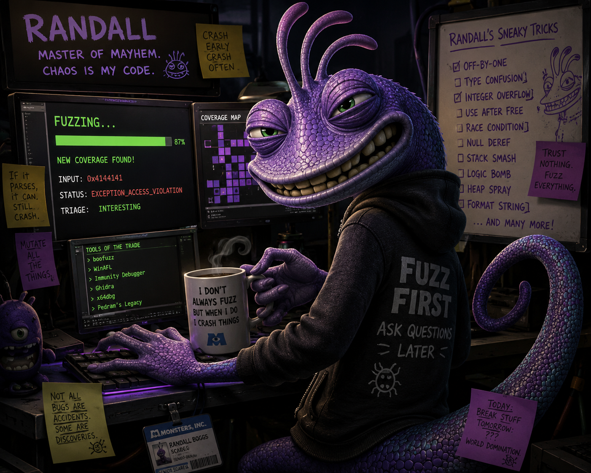

# Randall roadmap

<p align="center">
  
</p>

<p align="center"><em>Stalk code paths. Scream on crash.</em></p>

**Mission:** Intelligent, tricky fuzzing — not raw exec/s speed.

**Lab targets:** [vulnserver](TARGETS.md#vulnserver) · [Notepad++](TARGETS.md#notepadpp) · [cfpass](TARGETS.md#cfpass) (strange file formats)

View live status: `randall serve` → http://localhost:5000 → **Roadmap** tab, or `GET /api/roadmap`.

---

## Phase 1 — Lab targets + crash loop ✅

| Item | Status |
|------|--------|
| Project YAML loader (`projects/*.yaml`) | ✅ |
| Built-in tricky mutators (bitflip, expand, truncate, boundary, insert) | ✅ |
| **vulnserver** TCP fuzz (`TRUN /.:/` prefix) | ✅ |
| **notepadpp** file fuzz (XML + weird text seeds) | ✅ |
| **cfpass** file fuzz (placeholder binary seeds — replace with real format) | ✅ |
| Crash save + `index.jsonl` per target under `data/crashes/<name>/` | ✅ |
| CLI: `targets`, `fuzz`, `crashes`, `--dry-run` | ✅ |
| Full `replay` — `randall replay -c projects/x.yaml -i crash.bin` | ✅ |
| Minidump on hang (file targets) via `MiniDumpWriteDump` → `dumps/*.dmp` | ✅ |
| Web UI crash browser + `/api/crashes`, `/api/targets`, `/api/roadmap` | ✅ |

**Try it:**
```powershell
dotnet build
dotnet run --project src/Randall.Cli -- fuzz -c projects/vulnserver.yaml --dry-run
dotnet run --project src/Randall.Cli -- serve
dotnet run --project src/Randall.Cli -- replay -c projects/vulnserver.yaml -i data/crashes/vulnserver/<crash>.bin
```

---

## Phase 2 — Stalk (DynamoRIO) 🔄 scaffold

| Item | Status |
|------|--------|
| `DynamoRioRunner` — discover `drrun.exe`, run with `-t drcov` | ✅ scaffold |
| `CorpusTracker` — dedupe inputs by hash, save interesting corpus | ✅ scaffold |
| Wire coverage into fuzz loop (prioritize new edges) | ⬜ |
| GUI coverage for notepad++ / cfpass | ⬜ |

Set `DYNAMORIO_HOME` to your DynamoRIO install. Check `/api/coverage/status` in the web UI.

---

## Phase 3 — Network + proxy

- [ ] More vulnserver commands (session graph beyond TRUN)
- [ ] CANAPE-style MITM for future services
- [ ] Live edit / replay in proxy

---

## Phase 4 — Crash stalking + Ghidra

- [ ] Path dedup + first-diverge from drcov traces
- [ ] Export to Dragon Dance / Ghidra triage bundle
- [ ] PaiMei-style crash stalking hooks

---

## Phase 5 — Polyglot plugins + autopilot

- [ ] RPP process plugins (Python / Node / Rust)
- [ ] Standalone `dotnet publish` portable bundle
- [ ] Campaign scheduler + Cursor Automations integration

---

**Current focus:** Phase 2 — install DynamoRIO, run drcov on vulnserver, hook `CorpusTracker` into the fuzz loop.

Drop binaries into `targets/` per [TARGETS.md](TARGETS.md), then fuzz.
